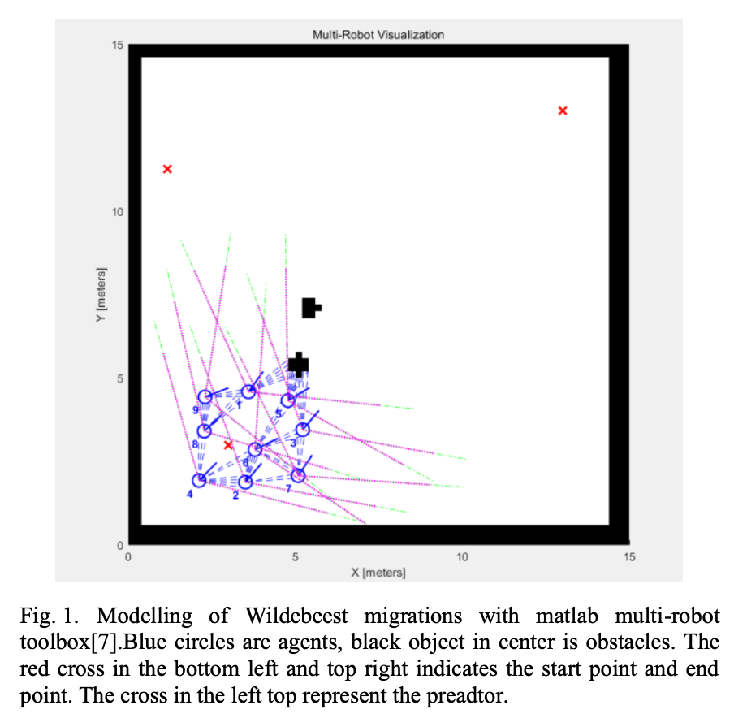
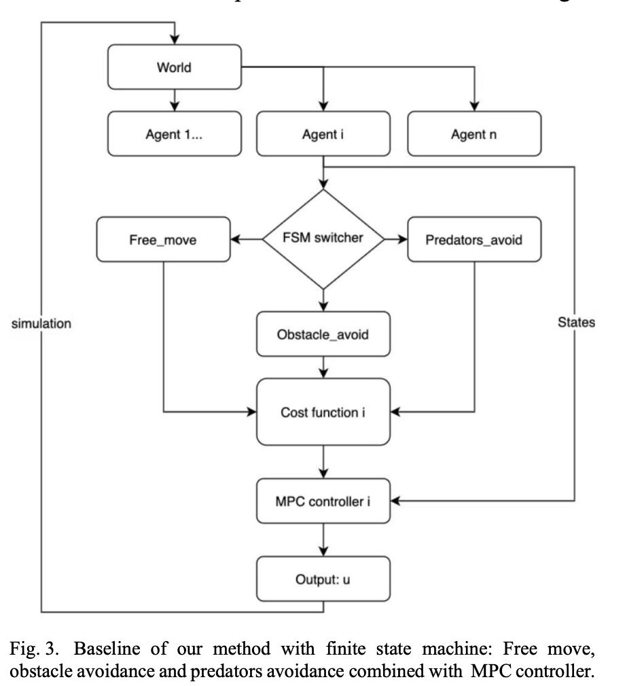

# Advanced topic in control 2021
In this project we present a formation optimization method based on finite-state machine and decentralized MPC. By attributing different cost items into state machine, the agent can perform certain intelligent behavior like obstacle avoidance, predator avoidance and younger protection. These behaviors are demonstrated by numerical simulation, where the effect of time horizon, agent number are analyzed. Our work provides a solution for optimizing the best path for the multi-agent system with different weights in the presence of hazards and obstacles.

## Wildebeest migrations modelling

 

The wildebeest migrate in a long range in search of water and grass. This behavior is cyclical and the migration paths remain relatively constant. Therefore we model the migrations problem by setting the tracking task of agents from start point to end point.

The primary goal of this work is to design the control law 𝛼 (𝑘), 𝛽 (𝑘) for each agent with local information available.
• In the migration the agent should maintain similar line speed to the previous agent to avoid collisions.
• In the migration the agent will tend to be close to important individuals (young) to protect their safety.
• In the migration the important agent will tend to approach the whole group for shelter.
• In the migration the predator(lion) will try to hunt down the closest agents.
• When the agent (wildebeest) senses out the predator(lion) is around it will focus on escaping.
• When the agent (wildebeest) detects the obstacles it will focus on more on the avoiding them.
• The agents are safe in the end point.

From above characteristics we reorganize the interaction of neighbors and its behaviors in wildebeest migratory into following laws.
1. Flocking cohesion and separation laws: Inspired by the work the cohesion and separation can be achieved by designing the collective potential functions to finish the local tasks:
||𝑞𝑗(𝑘) − 𝑞𝑖(𝑘)|| = 𝑑, ∀𝑗 ∈ 𝑁𝑖(𝑘)
Where d is the desired distance in a quasi-𝛼 formation. By formulating the task into energy form we get the first item in cost function.
𝐽1 = ∑ 𝑤 (||√(𝑥 −𝑥)2 +(𝑦 −𝑦)2 −𝑑||2) (4) 𝑖1𝑖𝑗𝑖𝑗
𝑗∈𝑁𝑖(𝑘)
By minimizing this term the relative distance between the agent and agents in front will be ensured.
2. Flocking alignment laws: The flocking alignment keeps the speed of agent i consistent with the front one. The consensus can be achieved by alignment and the agents go line up with agent in front.
𝐽2𝑖= ∑𝑤2(|𝑣𝑖−𝑣𝑗|) (5) 𝑗∈𝑁𝑖(𝑘)
By minimizing this term the linear velocity of agent i goes consensus with other agents.
3. Flocking obstacle avoidance laws: The flocking algorithm with obstacle avoidance create a new species of agents called 𝛽 agents.
 𝑖𝑖
The control laws are optimized to helps the distributed multi- agent system reach the endpoint as quickly as possible with the least loss of their group. We firstly introduce some basic concepts in graph theory.
The detection field of a wildebeest is a conical area so except for the face-to-face situation (rare when migrating) the wildebeest cannot get connection with each other so the local information like range, importance and velocity are not shared. We build the directed graph 𝐺 = (𝑉, Ε) to present the formation connection. The vertex set 𝑉 = {1,2, ... , 𝑛} denotes the agents and set Ε ⊆ 𝑉 × 𝑉 = {(𝑖,𝑗)|𝑖,𝑗 ∈ 𝑉} represent the directed edges between agent i and agents it detected. By define the detection maximal range 𝑑 and field of view f we can define the detection field 𝐷𝑖 of node i:

## BEHAVIOR-BASED DISCRETE-TIME MPC
 

In this section a decentralized Model Predictive Controller is proposed based on flocking protocol. In order to better mimic the behavior of wildebeest we adopt the behavior-based method. Similar to animal-like thinking that there is always a main task which owns highest priority: Foraging, courtship, predators escaping, we divide the behavior of agent (wildebeest) in our work into 3 categories: Free moving, obstacle avoidance and predator avoidance as shown in Fig above.

## Qualitativeanalysis
 

After showing the different behavior of our multi-agent system we will discuss two failure cases in our early work.

 

As Figure above shows two agents have opposite rotate direction in front of two very close obstacles. The costs reduction of avoiding the wall is offset by the separation costs increase. The (b) figure shows similar case when the costs reduction of avoiding predator is offset by the obstacle avoidance.
In order to solve this local minimum problem and inspired by roughing method in MPC controller we add a roughing noise to the pose states and the local minima problem is alleviated.
